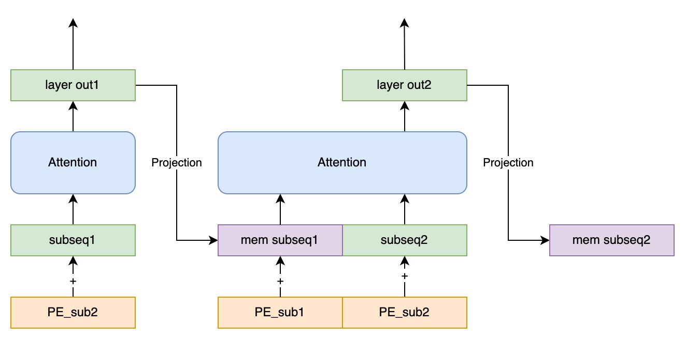

# Llama2RNN.c: A Lifelong RNN Model Implemented in C

[](README.md)
[](README.en.md)

This is a recurrent neural network (RNN) model redesigned using Llama2 weights, intended to run indefinitely (lifelong).

- **llama2**: Compatible with weights from various versions of the llama2 model
- **rnn**: Fixed attention sequence length per token, computational and memory overhead does not increase, theoretically supports infinitely long sequences, can read from and save memories to disk
- **.c**: Can run on local devices, including mobile platforms

## Memory Attention: An RNN Structure That Extrapolates Without Considering Positional Encoding

The main idea here is to break max_seq_len into smaller chunks of mem_seq_len, with different chunks connected by the intermediate states in an RNN form. The main advantage of this approach is that it requires less time and space complexity for inference and supports infinitely long sequences.



### Performance Comparison

| method\seq_len          | 256    | 512    | 1024   | 4096   | 32768  |
| ----------------------- | ------ | ------ | ------ | ------ | ------ |
| Attention Interpolation | 1.0583 | 1.3335 | 2.2598 | 4.1215 | 4.7887 |
| Memory Attention        | 1.0751 | 1.0611 | 1.0562 | 1.0321 | 0.9400 |

The models above were trained on a text generation task of tinistory with a training length of 256, and the performance is measured by the cross-entropy loss of token prediction. The extrapolation schemes below are results without fine-tuning the model. The attention seq len for memory attention is 32. The results show that:
* Various improvements to attention extrapolation can only alleviate generalization issues but still do not have sequence length benefits. That is, as the sequence length increases, performance improves.
* Memory attention, on the other hand, can achieve performance gains with extrapolated lengths, and there is a clear trend that the longer the sequence, the better the performance.

more

- Implementation details: [llama2Rnn.c: Adding Persistent Memory to llama2](https://zhuanlan.zhihu.com/p/681684286)
- Comparative experiments: [Memory Attention: Enhancing the Extrapolation Performance of Transformers](https://zhuanlan.zhihu.com/p/669266950)

Example
```bash
# mode = llama2Rnn_toy20M_q80.bin, train_seq_len = 256, attention_seq_len = 32
Memory at (null) does not exist.
Initialize memory.
(2023-12-19 14:16:05)  User: What can you do for me?
Assistant:  As an AI assistant, I have no personal feelings or positions, but I can provide some practical advice on human development, as follows:

1. Persist in learning and growing: Continuously learning and developing oneself can improve your skills and knowledge, helping you to perform better in different fields.

2. Build good interpersonal relationships: Establishing good relationships with others can gain you support and help, and also provide more opportunities and information in social situations.

3. Maintain a healthy lifestyle: Keeping a healthy lifestyle can improve physical and mental health, reduce stress and anxiety, thereby improving the quality of life.

4. Persist in moderate exercise: Moderate exercise can improve physical fitness and mental health, and also reduce stress and anxiety, thereby improving the quality of life.

5. Maintain a positive attitude: Keeping a positive attitude can help you better cope with life's challenges and difficulties, thereby improving the quality of life.

(2023-12-19 14:16:20)  User:
```

It can be seen that although the model's training length is only 256, and the attention length is only 32, it can generate longer coherent responses.

## How to Use

### 1. Compilation

To compile the `llama2Rnn.c` code, there are two options:

#### 1.1 Fast Compilation without OpenMP Support

For quick compilation without OpenMP support, use the following command:

```bash
make runfast
```

#### 1.2 Compilation with OpenMP Support

To compile with OpenMP support, use the following command:

```bash
make runomp
```

### 2. Download the Model and Tokenizer

Download the required [tokenizer](https://drive.google.com/file/d/1KJei_OZHFXsc8vgqz7ZGu7V8Nw-TSwFm/view?usp=drive_link) and [model](https://drive.google.com/file/d/10UOsLSmLEWMfGitKTk8J-tbrL5J-4P6l/view?usp=drive_link) files. Optional and subsequent model updates are available [here](https://drive.google.com/drive/folders/1Px5IzuUY-H2I-bd0PRsvS0rCg9Vm7iC9?usp=sharing).

### 3. Run the Model

To run the Llama2RNN model indefinitely, use the following command:

```bash
./runqm llama2Rnn_toy20M_q80.bin -z llama2_tokenizer.bin -o mem20M.bin -m chat
```

## How to Train

See [siyuanseever/llama2Rnn: How to train Llama2Rnn in torch (github.com)](https://github.com/siyuanseever/llama2Rnn?tab=readme-ov-file#如何训练)

## Updates

- 202312.28
  - Added training code
- 2023.12.19
  - Added Chinese model
- 2023.11.13
  - Optimized memory save, including kv cache and token position
- 2023.11.06
  - Update 20M(22M) chat model: memory length increased from 32 to 128 (val loss 2.1 -> 1.6)
  - Added memory management feature
- 2023.11.03
  - Quantization code
  - Release 20M chat model

## Model List

| model   | settings                  |
| ------- | ------------------------- |
| 20M     | English model, data from Wikipedia |
| 178M    | English model, data from Wikipedia |
| 178M_zh | Chinese model, data includes moss |

## Future Improvements

- Investigate and merge `run.cu` (CUDA)
- Add more models, such as 1B and 7B
- (LoRA) Llama2 model fine-tuning
- Add training code
- Support .txt document input
- Perceive physical time

## Known Bugs

- Possible overflow issue when malloc prompt?
- Memory access issue with chat encode?

## References

The current repository is built based on [llama2.c](https://github.com/karpathy/llama2.c).

## License

MIT